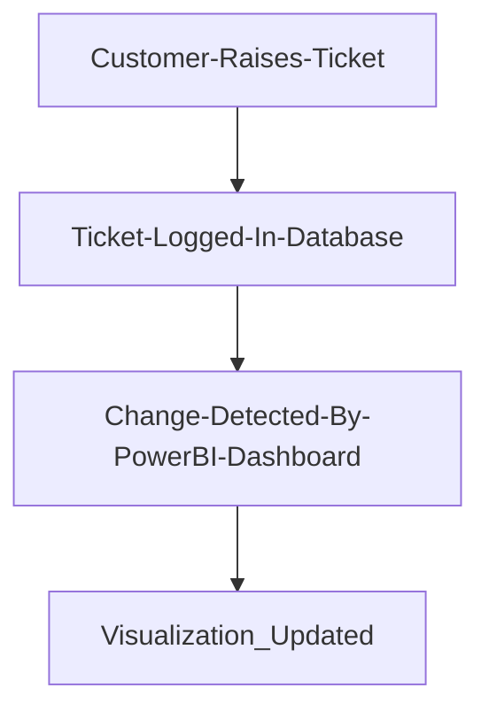
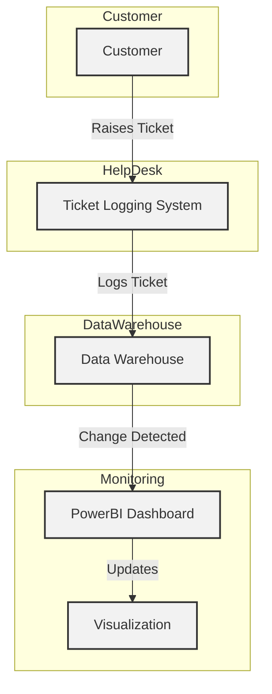

# Customer-Complaint-Dashboard
BI mini project
## Group Members 
1. BC218 Akshay Dongare
2. BC223 Jaydatta Patwe
3. BC213 Yash Dagadkhair
## Steps to run 
Upload dataset csv file (`customer_support_tickets.csv`) and PowerBI file (`report.pbix`) to PowerBI Desktop Application
## Flowchart

## DFD

